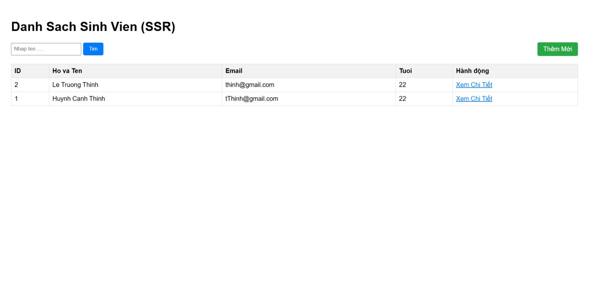
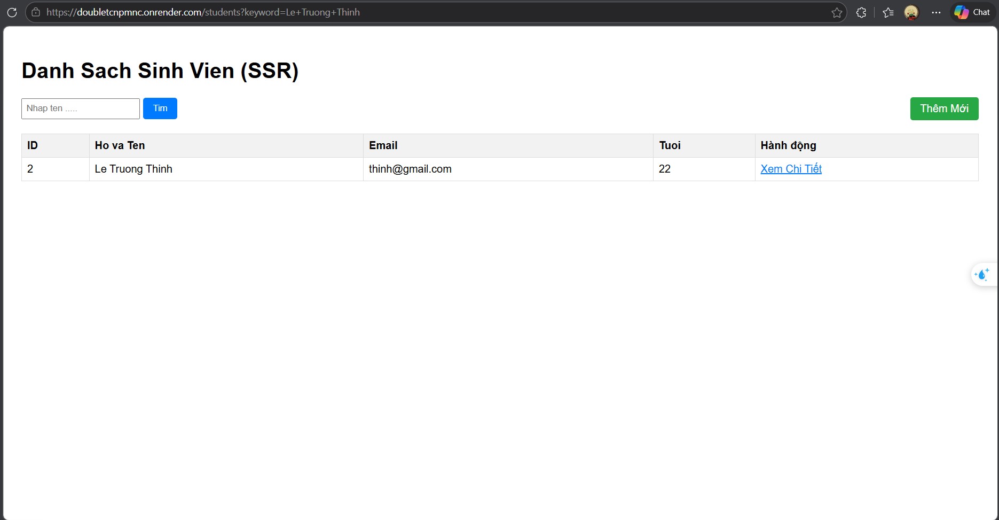
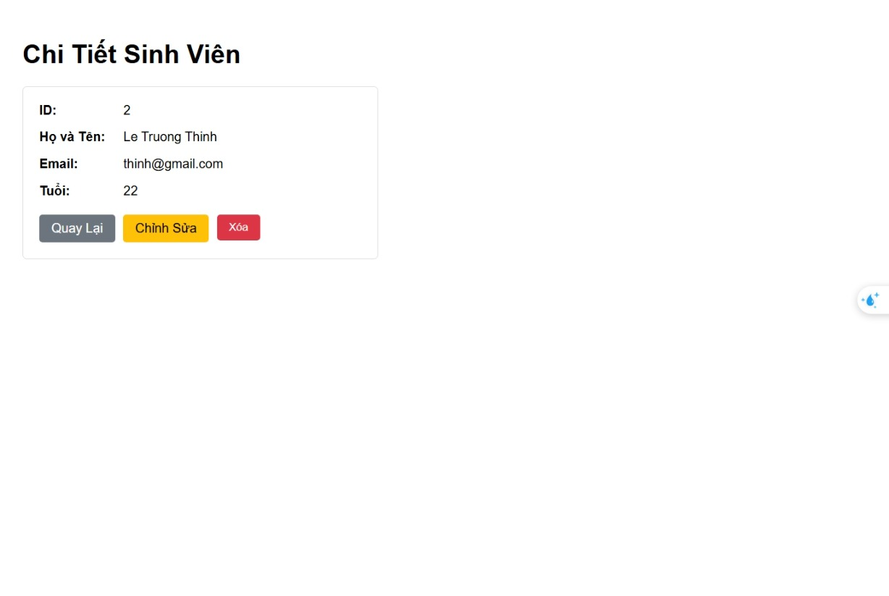
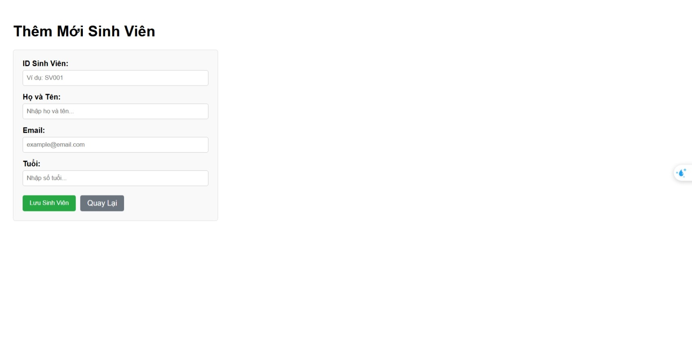
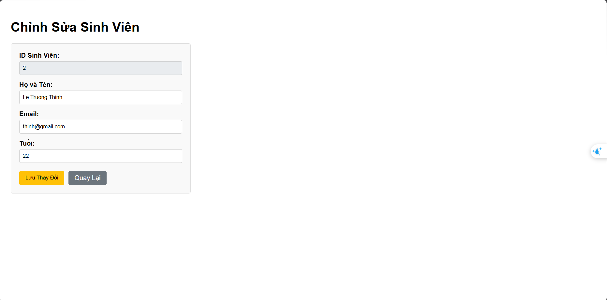
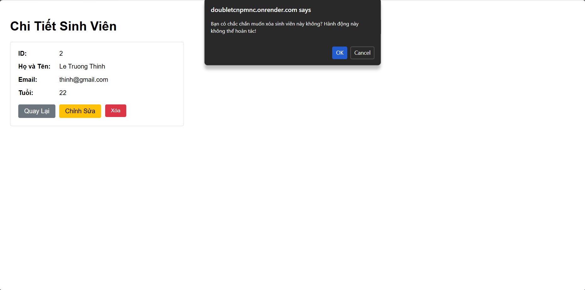

# Báo Cáo Thực Hành
## 1. Danh sách nhóm
* **Thành viên 1:** Lê Trường Thịnh - 2213282
* **Thành viên 2:** Huỳnh Cảnh Thịnh - 2213272

---

## 2. Public URL (Web Service)
* **Link Deploy:** https://doubletcnpmnc.onrender.com/students

---
## 3. Hướng dẫn cách chạy dự án
### Yêu cầu hệ thống:
* **JDK:** 21
* **Database:** PostgreSQL (Có thể dùng Docker hoặc cài đặt cục bộ)
* **IDE:** IntelliJ IDEA hoặc Eclipse/VS Code

### Các bước thực hiện:
1. **Clone project:** `git clone [URL_PROJECT]`
2. **Cấu hình Database:** Cài đặt và khởi chạy PostgreSQL. Tạo cơ sở dữ liệu `student_management` trên PostgreSQL.
3. **Cấu hình môi trường (`.env`):** Tạo file `.env` ở thư mục gốc của project với nội dung (nhớ cập nhật `POSTGRES_PASSWORD` cho đúng):
   ```properties
   POSTGRES_HOST=localhost
   POSTGRES_PORT=5432
   POSTGRES_DB=student_management
   POSTGRES_USER=postgres
   POSTGRES_PASSWORD=your_password_here
   ```
4. **Mở project:** Mở bằng IDE và đợi tải Maven.
5. **Cấu hình SDK:** Đảm bảo dự án dùng JDK 21.
6. **Chạy ứng dụng:** Chạy ứng dụng thông qua IDE (file `StudentManagementApplication.java`) hoặc dùng lệnh `mvnw spring-boot:run`.
7. **Truy cập:** Truy cập ứng dụng tại `http://localhost:8080/students`.

---

## 4. Screenshot các module (Lab 4)

### Trang Danh Sách & Tìm Kiếm (List View):

*Giao diện danh sách toàn bộ sinh viên khi mới tải trang.*


*Giao diện danh sách sinh viên sau khi nhập từ khóa tìm kiếm (Ví dụ: Tìm theo tên).*

### Trang Chi Tiết Sinh Viên (Detail View):

*Trang xem chi tiết thông tin của một sinh viên (Đổ dữ liệu lên theo ID).*

### Thao tác Thêm & Sửa Sinh Viên:

*Giao diện Form thêm mới sinh viên (Form trống).*


*Giao diện Form chỉnh sửa thông tin (Dữ liệu cũ được điền sẵn).*

### Hộp thoại xác nhận Xóa (Confirm Dialog):

*Hộp thoại (Popup/Dialog) cảnh báo người dùng xác nhận trước khi thực hiện xóa một bản ghi sinh viên khỏi Database.*

---

## 5. Câu trả lời lý thuyết các phần Lab

### LAB 1: Khởi Tạo & Kiến Trúc Hệ Thống
**Câu 1: Dữ liệu lớn: Hãy thử thêm ít nhất 10 sinh viên nữa.**

**Trả lời:**
Em đã thực hiện thêm nhanh các bản ghi bằng cách sử dụng câu lệnh `INSERT INTO` gộp (Bulk Insert). Việc không chỉ định cột `id` giúp SQLite tự động quản lý giá trị định danh tăng dần, giúp đảm bảo tính liên tục và tránh sai sót khi nhập liệu thủ công.

**Câu lệnh thực hiện:**

```sql
INSERT INTO students (name, email, age) VALUES 
('Hoang Anh', 'anh.h@gmail.com', 20),
('Minh Khoa', 'khoa.m@gmail.com', 21),
('Thu Thao', 'thao.t@gmail.com', 19),
('Gia Bao', 'bao.g@gmail.com', 22),
('Thanh Truc', 'truc.t@gmail.com', 20),
('Nhat Minh', 'minh.n@gmail.com', 21),
('Bao Ngoc', 'ngoc.b@gmail.com', 23),
('Quang Hai', 'hai.q@gmail.com', 20),
('Thuy Tien', 'tien.t@gmail.com', 19),
('Duc Phuc', 'phuc.d@gmail.com', 22);

```

---

**Câu 2: Ràng buộc Khóa Chính (Primary Key): Cố tình Insert một sinh viên có id trùng với một người đã có sẵn. Quan sát thông báo lỗi: `UNIQUE constraint failed`. Tại sao Database lại chặn thao tác này?**

**Trả lời:**

* **Hiện tượng:** Hệ thống thông báo lỗi `UNIQUE constraint failed: students.id`.
* **Giải thích:** Vì khi em thiết kế thực thể (Entity), thuộc tính `id` đã được xác định là **Khóa chính (Primary Key)**. Đặc tính cốt lõi của khóa chính là phải **Duy nhất (Unique)** để định danh cho từng bản ghi. Nếu Database cho phép trùng ID, hệ thống sẽ không thể phân biệt được các đối tượng khác nhau, dẫn đến việc truy vấn, cập nhật hoặc xóa dữ liệu sẽ bị sai mục tiêu hoặc gây xung đột dữ liệu.

---

**Câu 3: Toàn vẹn dữ liệu (Constraints): Thử Insert một sinh viên nhưng bỏ trống cột name (để NULL). Database có báo lỗi không? Từ đó suy nghĩ xem sự thiếu chặt chẽ này ảnh hưởng gì khi code Java đọc dữ liệu lên?**

**Trả lời:**

* **Kết quả:** Nếu cấu trúc bảng ban đầu không được đặt ràng buộc `NOT NULL`, Database sẽ **không báo lỗi** và vẫn chấp nhận lưu giá trị `NULL` cho cột tên.
* **Ảnh hưởng đến Java:** Khi Hibernate ánh xạ dữ liệu này vào đối tượng Java, thuộc tính `String name` sẽ nhận giá trị là `null`.
* **Hệ quả:** Điều này rất dễ gây ra lỗi **NullPointerException** khi em thực hiện các thao tác xử lý logic (ví dụ như hiển thị tên khách hàng trên ứng dụng Travello). Việc thiếu chặt chẽ ở tầng Database dẫn đến "dữ liệu bẩn", làm tăng rủi ro gây sập ứng dụng và khiến việc lập trình ở tầng Application trở nên phức tạp hơn do phải kiểm tra điều kiện null liên tục.

---

**Câu 4: Cấu hình Hibernate: Tại sao mỗi lần tắt ứng dụng và chạy lại, dữ liệu cũ trong Database lại bị mất hết?**

**Trả lời:**

* **Nguyên nhân:** Do trong file cấu hình dự án, thuộc tính `spring.jpa.hibernate.ddl-auto` đang được thiết lập là `create`.
* **Giải thích:** Chế độ `create` ra lệnh cho Hibernate thực hiện lệnh xóa sạch bảng (`DROP`) và tạo lại bảng mới (`CREATE`) mỗi khi ứng dụng khởi động lại.
* **Giải pháp:** Để bảo toàn dữ liệu cho dự án **Travello**, em cần chuyển cấu hình này sang `update` (chỉ cập nhật thay đổi cấu trúc) hoặc `none` (không can thiệp vào dữ liệu hiện có).

---
